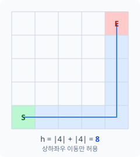
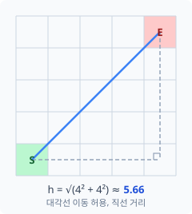
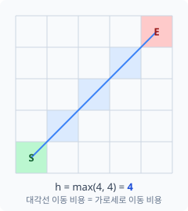

이전 Post에서는 최단 경로를 찾는 방법으로 다익스트라와 벨만 포드를 소개했다. 두 알고리즘 모두 좋은 방법이지만, 그래프가 커지고 노드가 많아지게 되면 모든 노드를 전부 탐색하는 낭비가 발생한다




A*는 여기에 방향 감각을 더한다. 가고자 하는 목적지를 선정하고 "지금까지 얼마나 왔는가"와 "앞으로 얼마나 남았는가"를 동시에 고려해 탐색 순서를 결정한다. 목적지 쪽으로 우선적으로 탐색하되, 실제 비용을 버리지 않아 최적해를 보장한다.

---

## A* 알고리즘이란?

A* 알고리즘은 목적지까지 가는 가장 빠른 경로를 찾는 알고리즘이다. 이때 가장 빠른 경로는 아래 공식을 통해서 계산한다.

```
f(n) = g(n) + h(n)
```

- **g(n)**: 시작점에서 노드 n까지 **실제**로 이동한 비용
- **h(n)**: 노드 n에서 목적지까지 **예상**되는 비용 (휴리스틱)
- **f(n)**: g와 h의 합. 시작점에서 노드 n을 찍고 목적지까지의 비용

A* 알고리즘에서는 각 노드를 거쳐서 가는 비용 **g(n)** 을 최소로 하는 경로로 찾는다. 이 중 **h(n)** 은 아직 가보지 않은 구간의 추정값이며 이 추정이 A*의 핵심이고, 어떻게 정의하느냐에 따라 알고리즘의 성능과 정확도가 달라진다.

---

## 휴리스틱 함수

h(n)이 실제 비용보다 **작거나 같아야** 최적해를 보장할 수 있다. 각 상황에 맞게 함수를 선택해야 하는데 예시로 그리드 맵에서 자주 쓰는 휴리스틱은 아래 세 가지이다.

<div class="grid">
  <div>
    <p><strong>맨해튼 거리</strong> — 4방향(상하좌우)으로만 이동 가능한 그리드에서 쓴다.</p>
    
  </div>
  <div>
    <p><strong>유클리드 거리</strong> — 대각선 이동이 허용될 때 쓴다.</p>
    
  </div>
</div>

<p><strong>체비쇼프 거리</strong> — 8방향 이동이 모두 동일한 비용일 때 쓴다. 대각선 이동 비용이 상하좌우와 같다고 가정한다.</p>


이 외에도 목적지까지의 직선 거리 등을 휴리스틱 함수로 많이 사용한다.

---

## 탐색 흐름

A*는 두 개의 자료구조로 탐색을 관리한다.

- **Open list**: 탐색 후보 노드를 f(n) 기준 최소 힙으로 보관한다.
- **Closed set**: 이미 확정된 노드. 재방문하지 않는다.

시작 노드를 Open list에 넣고 반복한다. f(n)이 가장 낮은 노드를 꺼내 인접 노드를 확인하고, 더 짧은 경로가 발견되면 g(n)을 갱신해 Open list에 추가한다. 꺼낸 노드가 목적지면 경로를 역추적해 반환한다.

---

## 구현

```python
import heapq

def heuristic(node, goal):
    # goal까지의 추정값 반환

# graph: {노드: [(비용, 이웃), ...]}
def astar(graph, start, goal):
    g = {start: 0}
    open_list = [(heuristic(start, goal), start, None)]  # (f, 노드, 부모)
    closed = {}  # {노드: 부모} — 확정 노드 및 경로 역추적 겸용

    while open_list:
        _, current, parent = heapq.heappop(open_list)  # f 최솟값 추출

        if current in closed:
            continue
        closed[current] = parent

        if current == goal:
            path = []
            node = goal
            while node is not None:
                path.append(node)
                node = closed[node]
            return path[::-1] # start 부터의 경로로 반환

        for cost, neighbor in graph[current]:
            if neighbor in closed:
                continue
            new_g = g[current] + cost
            if neighbor not in g or new_g < g[neighbor]:
                g[neighbor] = new_g
                f = new_g + heuristic(neighbor, goal)              # f 갱신
                heapq.heappush(open_list, (f, neighbor, current))  # open에 이웃 추가

    return None
```
---

## A* 알고리즘 확장

A*는 그 자체로도 강력하지만, 상황에 따라 낭비가 생기거나 결과물이 어색해지는 경우가 있다. 이를 보완하는 변형 알고리즘들을 소개한다.

### JPS — 대칭 경로 제거

장애물 없는 넓은 공간에서 두 지점을 잇는 같은 비용의 경로는 수없이 많다. A*는 이 경로들을 구별하지 못하고 모두 Open list에 올린다. 맵이 넓을수록 이 낭비가 커진다.

**JPS(Jump Point Search)** 을 통해 위 문제를 해결할 수 있다. 한 방향으로 이동하는 중에는 주위에 잘애물을 만나지 않는다면 해당 방향으로 직진하는게 직관적으로 최단 거리이다.  
따라서 JPS 알고리즘에서는 장애물로 인해 경로가 갈라지는 **점프 포인트**까지 한 번에 건너뛴다. 이 지점에서만 Open list에 추가하므로 탐색 노드 수는 크게 줄어들고 최적해는 그대로 보장된다.

```
function Jump(pos, dir, goal):
    if pos is blocked:
        return null                    # 벽이면 탐색 중단

    if pos == goal or PathDiverges(pos, dir):
        return pos                     # 점프 포인트 발견

    if dir is diagonal:
        # 대각선 이동 중엔 수평·수직 방향도 점프 시도
        if Jump(pos + horizontal(dir), goal) != null:
            return pos
        if Jump(pos + vertical(dir), goal) != null:
            return pos

    return Jump(pos + dir, dir, goal)  # 같은 방향으로 계속 점프
```

---

### Flow Field — 다수 에이전트의 경로 탐색

에이전트가 수백 명이고 목적지가 같을 때, A*를 개별로 호출하면 대부분 같은 계산을 반복한다.

**Flow Field**는 접근 방식이 다르다. 목적지 하나에 대해 맵 전체의 이동 방향을 **한 번만** 계산하고, 각 셀에 벡터로 저장해둔다. 계산은 목적지에서 역방향 BFS로 시작해 각 셀까지의 거리를 기록하고, 그 거리를 바탕으로 각 셀에서 "어느 방향이 목적지에 가장 가까운가"를 벡터로 표현한다.  
이후 에이전트는 자기 위치의 벡터만 읽어 이동하면 된다. 탐색 비용이 에이전트 수와 무관하게 고정된다. 단, 목적지가 자주 바뀌면 매번 재계산해야 하므로 효과가 반감된다.

```
function ComputeFlowField(goal):
    # 목적지에서 BFS로 거리 전파
    cost[goal] = 0
    queue = [goal]
    while queue not empty:
        cur = queue.pop()
        for each neighbor of cur:
            if cost[neighbor] == INF:
                cost[neighbor] = cost[cur] + 1  # 목적지까지 거리 기록
                queue.push(neighbor)

    # 각 셀에 이동 방향 벡터 설정 (이웃 중 최단 거리 노드 방향)
    for each cell:
        flow[cell] = direction to neighbor with lowest cost
```
