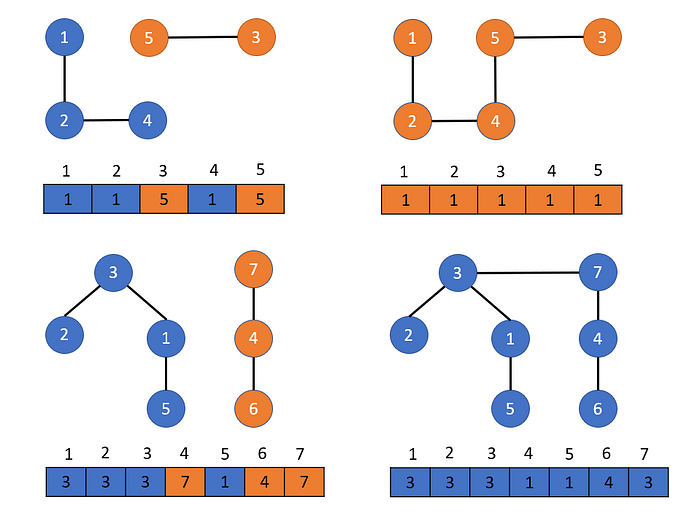

> 서로소 집합과 이를 구현하는 Union-Find 알고리즘에 대한 학습

---

## 1. 서로소 집합(Disjoint Sets)의 개념

**서로소 집합**은 임의의 두 집합 사이에 공통된 원소가 존재하지 않는 집합 관계를 의미한다. 즉, 모든 부분 집합들이 서로 중복되지 않는 상태를 유지한다. 

이러한 집합들의 상태를 관리하고, 특정 원소가 어떤 집합에 속해 있는지 판별하거나 두 개의 집합을 하나로 합치는 연산을 수행하기 위한 자료구조를 **서로소 집합 자료구조** 또는 **Union-Find 자료구조**라고 한다.

주로 그래프에서 사이클인지 판별할 때 사용한다.

---

## 2. Union-Find의 핵심 연산

Union-Find 자료구조는 크게 두 가지 연산을 통해 데이터를 관리한다.

1.  **Find (찾기)**: 주어진 원소가 속한 집합의 Root를 반환한다. 이를 통해 두 원소가 동일한 집합에 속해 있는지 여부를 판단할 수 있다.
2.  **Union (합치기)**: 두 개의 원소가 속한 각 집합을 하나의 집합으로 통합한다.

---



각 노드의 부모 정보를 저장하는 배열을 활용하여 집합을 표현한다. Union 과정에서 부모 정보를 확인하므로 같은 부모끼리 합치는 사이클이 생기지 않도록 한다.

---

## 구현 (Python)

각 노드의 부모 정보를 저장하는 배열을 활용하여 트리 구조로 집합을 표현한다.

```python
# 초기화: 모든 노드가 자기 자신을 부모로 가짐
parent = [i for i in range(n + 1)]

# Find : 대상 노드의 부모를 찾는다
def find(x):
    if parent[x] == x:
        return x
    return find(parent[x])

# Union : a의 부모를 b로 하여 두 노드를 합친다.
def union(a, b):
    root_a = find(a)
    root_b = find(b)
    if root_a != root_b:
        parent[root_a] = root_b
```

---

## 3. 알고리즘 최적화 기법

Union-Find의 시간 복잡도는 최적의 상황에서 상수 시간에 가까워지나, 트리가 한 줄로 이어지는 최악의 상황(Skewed Tree)에서는 $O(N)$까지 성능이 저하될 수 있다. 이러한 비효율성을 방지하기 위해 다음의 최적화 기법을 적용한다.

### 3.1 경로 압축 (Path Compression)

`find` 함수를 호출할 때 방문하는 모든 노드가 직접 루트 노드를 가리키도록 부모 정보를 갱신한다. 이 과정을 거치면 트리의 높이가 급격히 낮아져 이후의 연산 속도가 향상된다.

```python
def find(x):
    if parent[x] != x:
        # 루트 노드를 찾음과 동시에 부모 정보를 갱신 (경로 압축)
        parent[x] = find(parent[x])
    return parent[x]
```

### 3.2 높이 기반 결합 (Union by Rank)

두 집합을 합칠 때, 트리의 높이(Rank)가 낮은 트리를 높이가 높은 트리 아래에 자식으로 붙인다. 이는 트리의 전체 높이가 불필요하게 증가하는 것을 억제한다.

```python
rank = [0] * (n + 1)

def union(a, b):
    root_a = find(a)
    root_b = find(b)
    
    if root_a != root_b:
        # 낮은 랭크의 트리를 높은 랭크의 트리 아래에 연결
        if rank[root_a] < rank[root_b]:
            parent[root_a] = root_b
        elif rank[root_a] > rank[root_b]:
            parent[root_b] = root_a
        else:
            # 랭크가 같다면 한쪽을 합치고 랭크를 1 증가시킴
            parent[root_b] = root_a
            rank[root_a] += 1
```