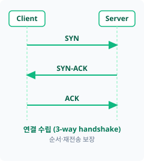
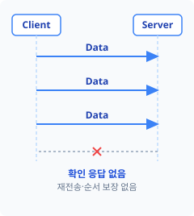

네트워크의 기본은 TCP와 UDP이다. 둘이 어떤 차이가 있는지, 그리고 IP와 어떻게 상호작용하는지 알아보고자 한다.

---

## OSI 7계층

네트워크 통신은 물리적으로 전선을 통해 전기 신호를 주고받는 일부터 시작해서 여러 층위의 작업을 거친다.

| 이름 | 설명 |
| :--- | :--- |
| **물리** | 0과 1을 전기 신호, 광 신호, 전파로 변환해 실제 매체 위로 전송한다 |
| **데이터&nbsp;링크** | 같은 네트워크 안에 있는 장치끼리 MAC 주소로 프레임을 주고받고, 오류를 검출한다 |
| **네트워크** | IP 주소를 기준으로 목적지까지의 경로를 정하고 패킷을 전달한다 |
| **전송** | 애플리케이션 간 데이터 전달을 담당하며, TCP와 UDP가 여기서 신뢰성과 속도 사이의 방식을 가른다 |
| **세션** | 통신 주체 간 연결을 수립하고 유지하며, 끊어지면 복구한다 |
| **표현** | 문자 인코딩, 압축, 암호화처럼 데이터의 표현 형식을 변환한다 |
| **응용** | HTTP, FTP처럼 사용자가 실제로 쓰는 애플리케이션 프로토콜이 동작한다 |

---

## TCP와 UDP

전송 계층은 같은 목적지 안에서도 어떤 애플리케이션이 데이터를 받을지 **포트 번호로 구분**하고, 데이터를 애플리케이션 단위로 쪼개거나 합쳐서 **전달**하는 역할을 한다. 이 역할을 수행하는 방식이 TCP와 UDP로 갈린다.



SYN, SYN-ACK, ACK로 연결을 맺고, 순서 번호로 재전송·재정렬을 보장한다. 신뢰성을 보장하는 대신 오버헤드가 크다.


handshake 없이 곧바로 데이터그램을 보내고, 순서 보장도 재전송도 없다. 오버헤드가 거의 없어 지연에 민감한 상황에 유리하다.

이 차이 때문에 웹 요청이나 파일 전송처럼 데이터가 하나라도 빠지면 안 되는 경우는 TCP를, 실시간 위치 동기화나 음성 통화처럼 최신 데이터 하나가 늦게 오는 것보다 계속 새 데이터가 오는 게 중요한 경우는 UDP를 쓴다.

---

## IP

TCP와 UDP가 전송 계층에서 애플리케이션 간 데이터 전달을 맡는다면, IP는 그 아래 네트워크 계층에서 사용되는 논리적 주소이다.

TCP나 UDP로 만든 데이터는 IP 패킷 안에 실려서 이동한다. TCP 세그먼트나 UDP 데이터그램이 IP 헤더로 한 번 더 감싸져서 목적지 주소를 향해 전달되는 방식이다. 라우터는 이 IP 헤더만 보고 패킷을 전달하며, 안에 담긴 내용이 TCP인지 UDP인지는 신경 쓰지 않는다.

### CIDR 표기

라우터가 목적지를 찾는 기준은 IP 주소 전체가 아니라 그 안의 네트워크 부분이다. 이 네트워크 부분의 경계를 표기하는 방식이 **CIDR**이다. `192.168.0.0/24`처럼 IP 주소 뒤에 `/`와 프리픽스 길이를 붙이는데, 앞쪽 비트만큼은 네트워크를, 나머지는 그 네트워크에 속한 호스트를 가리킨다는 뜻이다.

| 표기 | 네트워크 비트 | 호스트 비트 |
| :--- | :--- | :--- |
| `/16` | 16 | 16 |
| `/24` | 24 | 8 |

프리픽스 숫자가 클수록 네트워크 부분이 넓어지는 대신 호스트로 쓸 수 있는 주소는 줄어든다.

### CIDR 계산

`192.168.1.100/26`을 예로 네트워크 주소와 사용 가능한 호스트 범위를 구해보자.

1. 호스트 비트 수 — `32 - 26 = 6`비트
2. 네트워크 주소 — `192.168.1.64`
3. 브로드캐스트 주소 — 다음 블록 시작값 `- 1` → `192.168.1.127`
4. 사용 가능 호스트 범위 — `192.168.1.65` ~ `192.168.1.126` (호스트 수 `64 - 2 = 62`)

네트워크 주소와 브로드캐스트 주소는 각각 해당 대역의 첫 주소와 마지막 주소라서 호스트로 쓸 수 없다. 그래서 실제 사용 가능한 호스트 수는 항상 블록 크기보다 2개 적고, 라우터는 패킷의 목적지 IP가 어느 네트워크 대역에 속하는지 이 계산으로 판단해서 경로를 결정한다.
