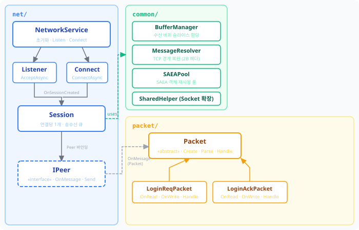

서버 학습을 위한 간단한 프로젝트 진행 중 내용 기록 목적으로 작성한다. "유니티 개발자를 위한 c#으로 온라인 게임 서버 만들기" 서적 기반으로 진행했다.

## 폴더 구성

<div class="grid" style="grid-template-columns: repeat(3, 1fr);">



</div>

주요 코드는 세 부분으로 나눴다. 공용으로 사용되는 코드는 `Shared`로 분리하여 `Server`에서는 직접, `Client`에서는 dll을 통해 접근하도록 처리했다.

---

## Shared

`Shared`는 네트워크 레이어 전체를 담고 있으며 아래 구조로 정리된다.

| network | common | packet |
|:---|:---| :---|
| 연결·송수신 처리 | 유틸리티 | 프로토콜 패킷 |



### network

`NetworkService`가 전체 진입점이다. 서버 측에서 연결 대기하는 `Listen()`, 클라이언트 측에서 연결을 요청하는 `Connect()` 두 경로 모두 세션이 만들어지는 시점에 `OnSessionCreated` 콜백을 발화한다. 이후 콜백에서 `Session`을 받아 `IPeer` 구현체를 만들고 바인딩한다.

`Session`은 한 연결의 송수신을 책임지는 객체다. `byte[]` 데이터를 `Packet`으로 복원해 `IPeer`에게 전달한다. TCP는 전달되는 데이터가 나뉘어서 들어올 수 있으므로 `MessageResolver`로 길이 기준 경계를 복원한다. 송수신 과정에서는 `SocketAsyncEventArgs`를 사용해 IOCP 구조를 활용한다.

`IPeer`는 `Session`과 게임 로직을 분리하는 인터페이스다. `Session`은 메시지가 완성되면 `OnMessage`를 부르고, 연결이 끊기면 `OnRemoved`를 부를 뿐이다.

```csharp
public interface IPeer
{
    void OnMessage(Packet packet); // 수신 패킷 전달
    void OnRemoved();              // 연결 해제 알림
    void Send(Packet packet);
    void Disconnected();
}
```

서버의 `User`와 클라이언트의 `ServerSession`이 같은 `Session` 코드를 공유하면서 패킷 처리 방식을 각자 다르게 구현할 수 있는 이유가 여기에 있다.

### packet

데이터 구조는 `[2B 전체 길이][2B 프로토콜 ID][payload]`이다.

추상 클래스 `Packet`이 송신과 수신 두 가지 경로를 제공한다. 송신 시에는 `Create<T>`로 빈 버퍼를 받아 하위 클래스가 `OnWrite`에서 payload를 채운다. 수신 시에는 `Parse`가 프로토콜 ID를 읽어 등록된 파서를 찾고 `OnRead`로 역직렬화한다.

```csharp
public abstract class Packet
{
    public static T Create<T>(IPeer owner) where T : Packet, new() { ... } // 송신용
    public static Packet? Parse(IPeer owner, ArraySegment<byte> buffer) { ... } // 수신용

    public abstract void Handle();       // 패킷 처리 로직
    protected virtual void OnRead()  {} // 역직렬화 (수신)
    protected virtual void OnWrite() {} // 직렬화   (송신)
}
```

`LoginReqPacket`과 `LoginAckPacket`은 `Packet`을 상속해 각각 세 메서드를 구현한다. `Handle()`에서는 응답 패킷을 직접 만들어 `Owner.Send()`로 돌려보낼 수 있다.

---

## Server

서버 진입점은 `NetworkService`를 초기화하고 포트를 열어 둔 채 대기한다. 클라이언트가 접속하면 `OnSessionCreated`에서 `User` 객체를 만들고 세션에 바인딩한다.

`User`는 서버 측 `IPeer` 구현체다. `OnMessage`에서 `packet.Handle()`을 즉시 호출한다. 현 단계에서는 게임 로직이 단순해 IOCP 워커 스레드에서 바로 처리해도 충돌이 없다. 상태 공유가 복잡해지면 단일 워커 스레드로 직렬화하거나 락 범위를 늘려야 한다.

---

## Client

클라이언트는 Unity 프로젝트다. `NetworkSystem(MonoBehaviour)`이 연결과 초기 송신을 담당하고, `ServerSession`이 스레드 경계를 처리한다.

Unity에서는 IOCP 워커 스레드에서 Unity API를 직접 호출할 수 없다. 항상 메인 스레드에서만 실행해야 하기 때문에 서버의 `User`처럼 `OnMessage`에서 바로 처리하면 크래시가 난다.

`ServerSession`은 이를 해결하기 위해 `OnMessage`에서 패킷을 `ConcurrentQueue`에만 넣어 둔다. `NetworkSystem.Update()`가 매 프레임 이 큐를 비우며 메인 스레드에서 패킷을 처리한다. IOCP 스레드가 쓰고 메인 스레드가 읽는 구조라 `ConcurrentQueue`의 락프리 특성이 적합하다.