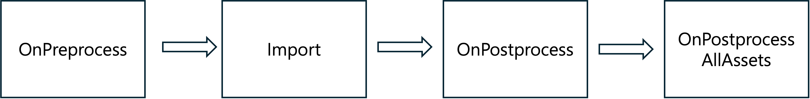

우선 Asset Postprocessor를 사용하는 이유를 알고 싶다면 아래 블로그 글이 도움이 될 것이다. Asset Postprocessor에 대한 내용은 별로 없지만 왜 Asset Postprocessor를 사용하는지, 생산 파이프라인을 구성해야 하는지에 대해 알 수 있다.

{{< linkcard 
  url="https://unity.com/blog/games/rapid-design-iteration-in-breachers-using-assetpostprocessor-and-blender" 
  title="Rapid design iteration in Breachers using AssetPostprocessor and Blender" 
  description="Triangle Factory’s Jel Sadones and Pieter Vantorre walk through their Blender-to-Unity pipeline and how they brought the VR tactical FPS title Breachers to life." 
  image="https://cdn.sanity.io/images/fuvbjjlp/production/7337649fa25211d0a7a2187b2c702a41973c242f-1230x410.png" 
  site="Unity Blog"
>}}

## AssetPostprocessor란?

Unity 프로젝트가 커질수록 임포트해야 하는 에셋의 수도 기하급수적으로 늘어난다. 수많은 FBX 파일을 일일이 클릭해서 `Animation`을 설정하고 `Read/Write` 옵션을 끄는 작업은 비효율적일 뿐만 아니라 휴먼 에러가 발생하기 딱 좋다.

`AssetPostprocessor`는 에셋이 임포트될 때 호출되는 이벤트를 가로채서 설정을 자동으로 바꿔주는 강력한 에디터 기능을 제공한다. 이를 통해 프로젝트 전체의 데이터 규격을 강제하고 최적화를 자동화할 수 있다. Asset Import 과정은 아래 순서로 진행된다.

<div style="margin-bottom: 50px;"></div>



<div style="margin-bottom: 50px;"></div>

여기서 FBX를 조정할 때 사용되는 건 아래의 `OnPreprocessModel`, `OnPostprocessModel`이다.

- **OnPreprocessModel**
    - Import 이전에 실행. FBX의 Inspector 설정 등을 조정
- **OnPostprocessModel**
    - Import 이후에 실행. Import된 FBX에 Component를 붙이는 등 작업 수행
- **OnPostprocessAllAssets**
    - 가장 마지막에 1회 실행. Import 된 전체 Asset을 받고 동기화 등 작업 수행

### AssetImporter 구성

`AssetImporter`는 Asset이 import 될 때의 정보를 가진 객체이다. 특히 FBX를 대상으로 하는 `ModelImporter`의 값을 통하여 FBX의 설정을 제어할 수 있다.

---

## FBX Import 자동화 예시

아래는 모델 에셋이 프로젝트에 추가될 때 자동으로 메시를 최적화하고 불필요한 데이터를 제거하는 간단한 스크립트다. 이 파일은 반드시 `Editor` 폴더 안에 위치해야 한다.

```csharp

using UnityEditor;
using UnityEngine;

public class ModelImport : AssetPostprocessor
{
    void OnPreprocessModel()
    {
        // 현재 FBX에 해당하는 importer 가져오기
        ModelImporter importer = (ModelImporter)assetImporter;
        
        importer.isReadable = false;
        importer.importNormals = ModelImporterNormals.None;
    }

    void OnPostprocessModel(GameObject gameObject)
    {
        // import이후 component 부착
        gameObject.AddComponent<Rigidbody2D>();
    }

    static void OnPostprocessAllAssets(string[] importedAssets, 
        string[] deletedAssets, string[] movedAssets, string[] movedFromAssetPaths)
    {
        // import 된 전체 파일 확인
        foreach (string path in importedAssets)
        {
            Debug.Log("방금 수입 완료된 파일 경로: " + path);
        }
    }

    // version이 더 높은 asset이 import 되면 version이 더 낮은 모든 Asset reimport한다.
    public override uint GetVersion() { return 1; }
}
```

위 과정을 통해 import 되는 FBX들 설정 자동화를 진행할 수 있다. 이 외에도 `importSettingsMissing` 등의 flag로 meta 파일 없는 첫 import인지 파악할 수 있다.
