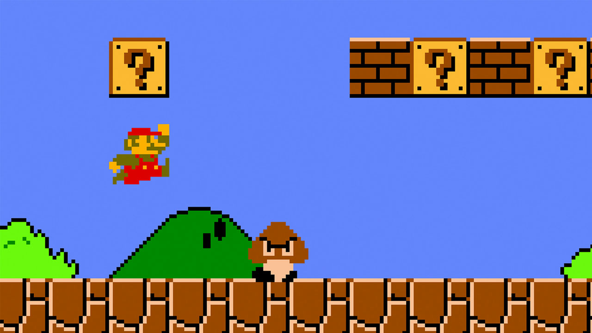

## 최적화가 필요한 이유



<div style="margin-bottom: 50px;"></div>

마리오나 커비, 할로우나이트 같은 2D 플랫포머 게임들은 플레이어를 깊게 몰입하게 한다. 직접 플랫포머 캐릭터를 구현하다 보면 그 이유를 알게 된다. 버튼을 눌렀는데 점프가 안 되거나, 절벽 끝에서 발을 헛디디면 몰입이 바로 깨진다. 조작이 자연스럽지 않으면 게임이 아니라 입력 오류와 싸우는 경험이 된다. 이 글에서는 점프 경험을 개선하는 두 기법인 **Coyote Time**과 **Jump Buffer**를 다룬다.

---

## Coyote Time

코요테 타임은 캐릭터가 땅에 닿지 않더라도 짧은 시간 동안 점프할 수 있도록 하는 잠깐의 시간을 의미한다. 절벽 끝을 살짝 지나쳤을 때도 점프가 되는 그 느낌이 여기서 나온다.

구현 원리는 단순하다. 매 프레임 지상 여부를 확인하고, 지상이었던 마지막 시각을 기록한다. 점프 입력이 들어왔을 때 `현재 시각 - 마지막 지상 시각`이 허용 윈도우 안이면 점프를 실행한다.

```csharp
// 매 프레임 지상 시각 갱신
if (CheckGround())
{
    lastGroundedTime = Time.time;
    if (verticalVelocity < 0f) verticalVelocity = 0f;
}
else
{
    verticalVelocity += gravity * Time.deltaTime;
}

// coyoteTime 윈도우 안이면 공중에서도 점프 허용
if (Keyboard.current.spaceKey.wasPressedThisFrame)
{
    if (Time.time - lastGroundedTime <= coyoteTime)
        verticalVelocity = jumpPower;
}
```

`coyoteTime`은 0.1~0.2초가 적당하다. 너무 길면 공중에서 점프하는 느낌이 되고, 너무 짧으면 효과가 없다. 0.15f는 대부분의 플랫폼 게임에서 잘 맞는 기본값이다.

---

## Jump Buffer

Coyote Time이 "늦게 누른 점프"를 처리한다면, Jump Buffer는 "일찍 누른 점프"를 처리한다.

캐릭터가 적 위로 떨어지거나 눈 앞의 장애물을 바로 피해야 하는 긴박한 상황에서 정확하게 점프를 누르기는 쉽지 않다. 아직 공중에 있는 상황에서도 미리 점프할 수 있게 하여 이런 어려움을 해소할 수 있다.

```csharp
// 점프 입력이 들어온 시각을 기록 (조건 미충족이어도 저장)
if (Keyboard.current.spaceKey.wasPressedThisFrame)
    lastJumpPressTime = Time.time;

// 지상 조건이 충족되면 버퍼된 입력으로 점프
bool jumpRequested = Time.time - lastJumpPressTime <= jumpBufferTime;

if (CheckGround() && jumpRequested)
{
    verticalVelocity = jumpPower;
    lastJumpPressTime = -1f; // 버퍼 소모
}
```

`wasPressedThisFrame`은 매 프레임 사라지지만 `lastJumpPressTime`은 남는다. 점프 실행 후 `-1f`로 초기화해 버퍼를 소모시키는 것도 중요하다. 그렇지 않으면 착지할 때마다 의도치 않은 점프가 발생한다.
